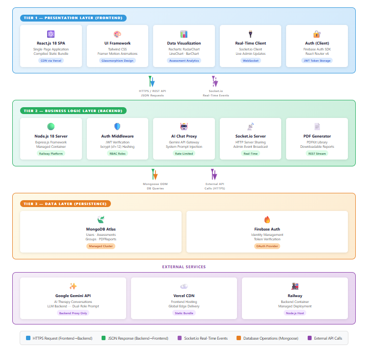
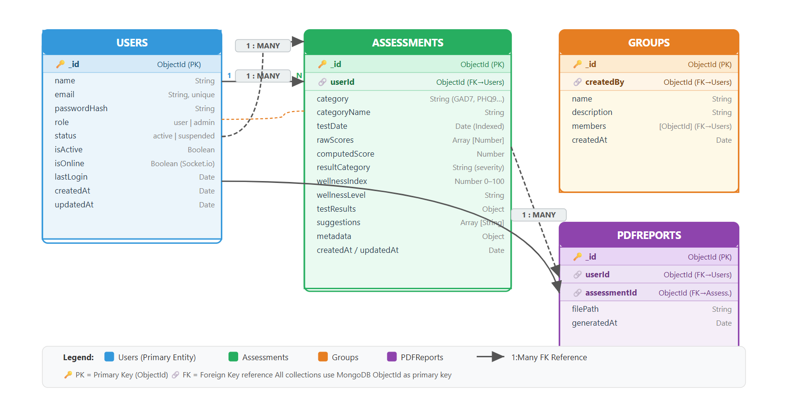
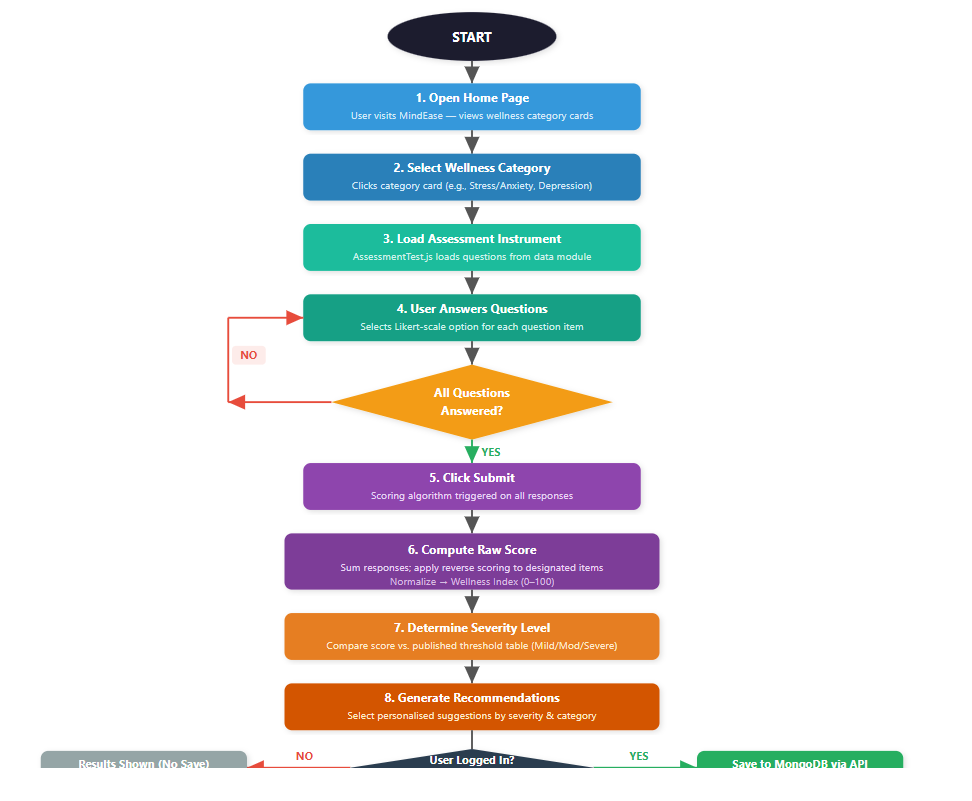
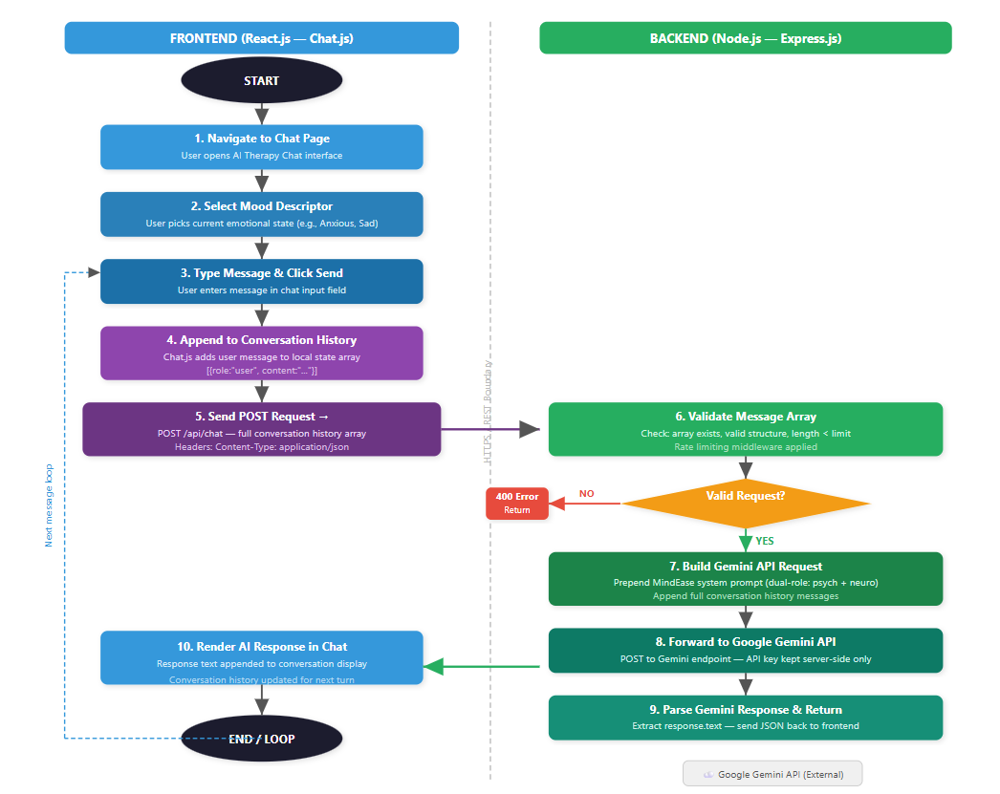

# 🧠 MindEase ✨

### *AI-Powered Mental Wellness Platform*

 

### 🌐 Live Demo

👉 https://mindeasewell.netlify.app/

---

# 🌌 Overview

MindEase is a **full-stack AI-powered mental wellness platform** designed to deliver
**accessible, intelligent, and real-time psychological support**.

It integrates:

* 🧪 Clinical Assessments
* 🤖 AI Therapy (Gemini)
* 📊 Data Analytics
* ⚡ Real-Time Systems

---

# 🧩 System Architecture

> Scalable 3-tier modular architecture with real-time and AI integration

  

---

# 🗄️ Database Design (ERD)

> Structured MongoDB schema with relationships

  

---

# 🔄 Assessment Processing Flow

> User interaction → scoring → insights → storage

  

---

# 🤖 AI Therapy Flow

> User → Backend → Gemini AI → Response Loop

  

---

# 🎯 Core Modules

## 🧪 Assessment Engine

* [x] 9 Clinical Tests (PSS-10, GAD-7, PHQ-9, etc.)
* [x] Dynamic Question Rendering
* [x] Automated Scoring Algorithm
* [x] Severity Classification
* [x] Data Persistence

---

## 🤖 AI Therapy System

* [x] Google Gemini Integration
* [x] Context-aware Conversations
* [x] Multi-turn Memory Handling
* [x] Emotion-based Interaction

---

## 📊 User Dashboard

* [x] Real-time Mental Health Tracking
* [x] Recharts Visualizations
* [x] Wellness Index Score
* [x] Personalized Recommendations

---

## 🛠️ Admin Panel

* [x] User Management System
* [x] Chat Monitoring
* [x] Analytics Dashboard
* [x] Real-time Activity Tracking

---

## ⚡ Real-Time Engine

* [x] Socket.io Integration
* [x] Live Chat Updates
* [x] Event Broadcasting

---

# 🧠 Tech Stack

### 🎨 Frontend

React 18 · Tailwind CSS · Framer Motion · Recharts

### ⚙️ Backend

Node.js · Express.js

### 🗄️ Database

MongoDB · Firebase

### 🤖 AI

Google Gemini API

### ☁️ Deployment

Netlify · Railway

---

# 🔐 Security

* 🔑 Firebase Authentication
* 🔒 JWT-based Authorization
* 🛡️ Secure API Handling
* ⚙️ Environment Variables

---

# 🚀 Future Scope

* 🎥 Video Therapy Sessions
* 🌍 Multi-language Support
* 🧠 Advanced Emotion Detection
* ⌚ Wearable Integration

---

# 👨‍💻 Author

**Devansh Gupta**
AI | Web Development | Mental Health Tech

---

⭐ *Building technology that understands humans*

